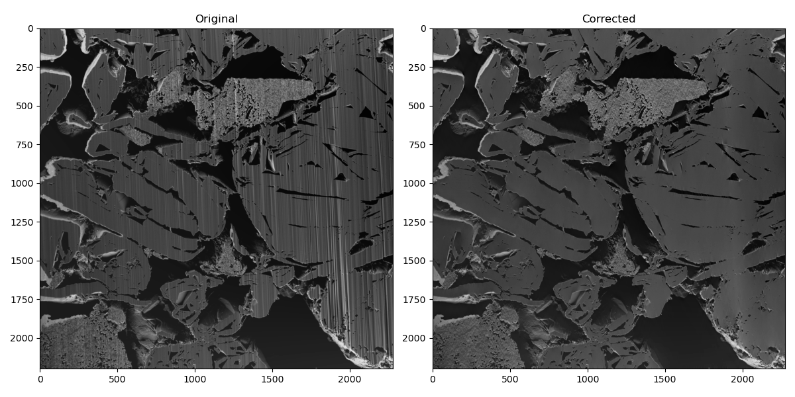
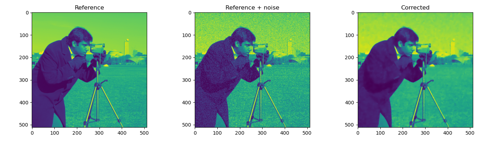
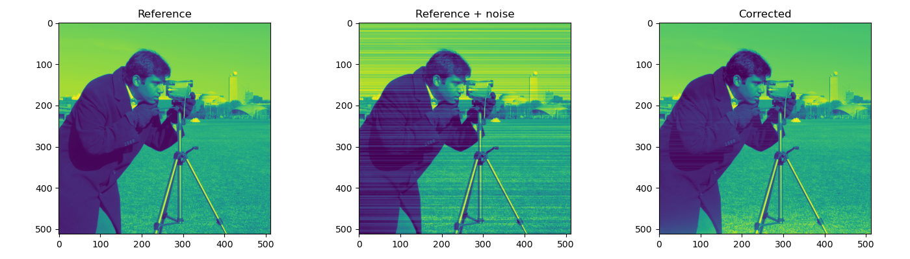
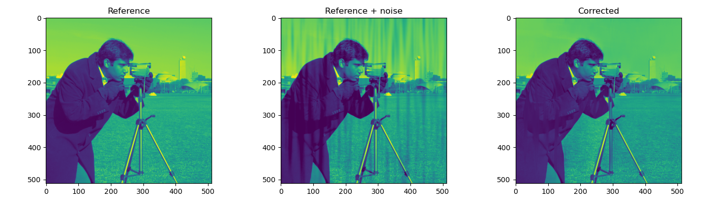

# pyVSNR
VSNR (Variational Stationary Noise Remover) algorithm in python



## Description

This repository contains the sources of the 2D-GPU based denoising code of
 the VSNR algorithm obtained from the cuda implementation in 
 [https://github.com/pierre-weiss/VSNR_2D-3D_GPU](https://github.com/pierre-weiss/VSNR_2D-3D_GPU).

It completes the 2D-CPU/GPU port from MATLAB to python realized in
[https://github.com/patquem/pyvsnr](https://github.com/patquem/pyvsnr)

 
## Installation

    $ pip install git+https://github.com/CEA-MetroCarac/pyVSNR.git

## Requirements

- ctypes
- numpy
- matplotlib, skimage (for examples execution only)

## Usage


```python
from pyVSNR import vsnr2d
from skimage import io

# read the image to correct
img = io.imread('image.tif')

# filters definition (Gabor and Dirac filters combination)
filter1 = {'name':'Gabor', 'noise_level':20, 'sigma':(3, 40), 'theta':210}
filter2 = {'name':'Dirac', 'noise_level':10}
filters = [filter1, filter2]

# image processing
img_corr = vsnr2d(img, filters, nite=100)

...
```
Some applicative examples are given in 
[examples.py](pyVSNR/examples.py) and reproduced hereafter. 


**gaussian noise removal example** :

```python
from pyVSNR.examples import ex_camera_gaussian_noise 
ex_camera_gaussian_noise() 
```

 
**stripes removal example** :

```python
from pyVSNR.examples import ex_camera_stripes 
ex_camera_stripes() 
```


**curtains removal example** :

```python
from pyVSNR.examples import ex_camera_curtains 
ex_camera_curtains() 
```


**curtains removal example on real image (FIB-SEM)** :

```python
from pyVSNR.examples import ex_fib_sem 
ex_fib_sem() 
```


## Authors informations

This is a port to python of the original code developed by Jean EYMERIE
 and Pierre WEISS.

All credit goes to the original authors.

In case you use the results of this code with your article, please don't forget
to cite:

- Fehrenbach, Jérôme, Pierre Weiss, and Corinne Lorenzo. "*Variational algorithms to remove stationary noise: applications to microscopy imaging.*" IEEE Transactions on Image Processing 21.10 (2012): 4420-4430.
- Fehrenbach, Jérôme, and Pierre Weiss. "*Processing stationary noise: model and parameter selection in variational methods.*" SIAM Journal on Imaging Sciences 7.2 (2014): 613-640.
- Escande, Paul, Pierre Weiss, and Wenxing Zhang. "*A variational model for multiplicative structured noise removal.*" Journal of Mathematical Imaging and Vision 57.1 (2017): 43-55.

